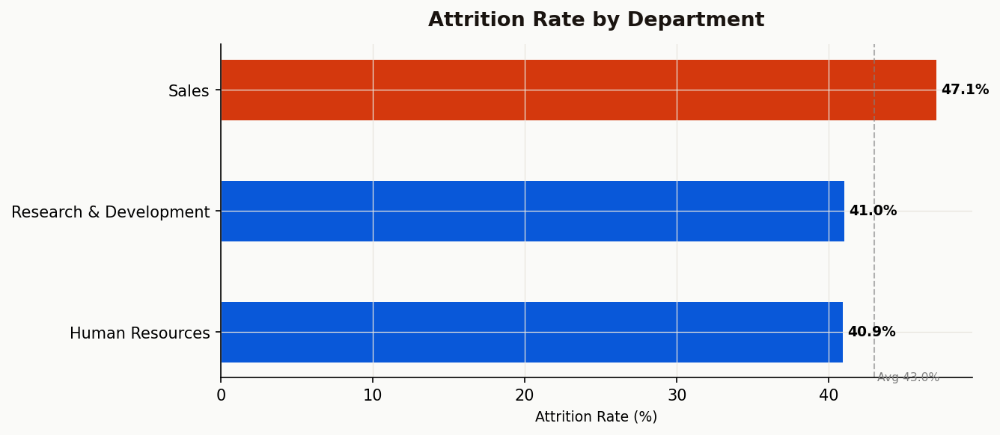
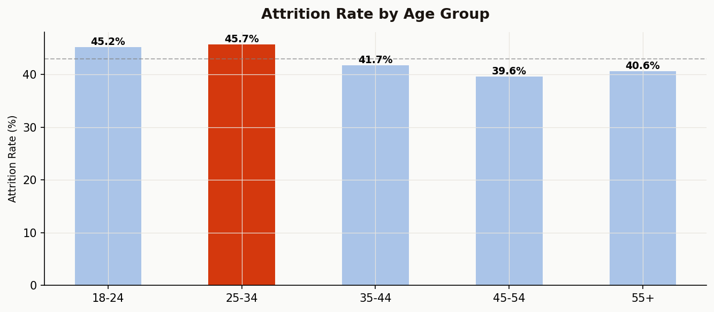
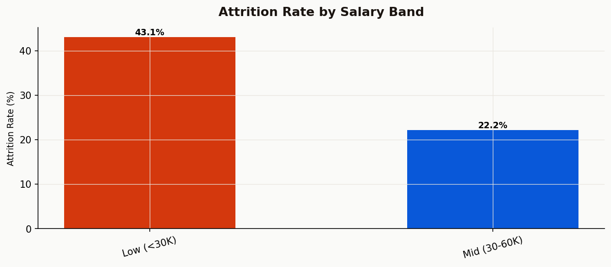
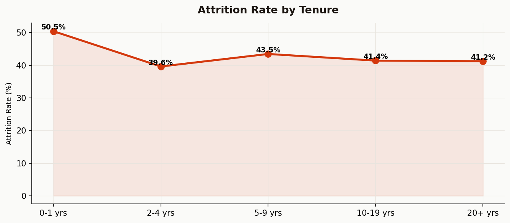

# 👥 HR Attrition Analytics

Interactive people-analytics dashboard that generates a realistic 1,470-employee
attrition dataset, identifies the key drivers of employee turnover across four
dimensions, and exports a boardroom-ready Excel report.

> **Live demo:** _coming once deployed to Streamlit Cloud — see "Deploy" section below._

---

## What it does

- Generates a synthetic IBM-style HR dataset with realistic noise (missing
  values, duplicates) and a probabilistic attrition model
- Cleans the data and engineers four analytical dimensions: department,
  age group, salary band, and tenure
- Renders four publication-quality charts highlighting the highest-risk segment
  in each dimension
- Produces an executive summary with quantified findings and three concrete
  recommendations
- Exports a polished Excel workbook with five sheets:
  Dashboard (KPIs + embedded charts), KPI Summary, Dept Analysis, Raw Data,
  Executive Summary

---

## Screenshots






---

## Tech stack

| Layer        | Tools                          |
| ------------ | ------------------------------ |
| UI           | Streamlit                      |
| Data         | pandas, numpy                  |
| Charts       | matplotlib                     |
| Reporting    | openpyxl                       |
| Language     | Python 3.10+                   |

---

## Run locally

```bash
git clone https://github.com/shahnawz2552/HR-Attrition-Analysis.git
cd HR-Attrition-Analysis

python -m venv .venv
source .venv/bin/activate          # Windows: .venv\Scripts\activate
pip install -r requirements.txt

# Option 1 — interactive Streamlit dashboard
streamlit run app.py

# Option 2 — CLI: generate data + charts + Excel into ./output/
python hr_pipeline.py
```

---

## Deploy to Streamlit Cloud

1. Push this repo to GitHub (already done if you cloned from above).
2. Go to https://share.streamlit.io and sign in with GitHub.
3. Click **New app**, choose this repository, branch `main`, main file `app.py`.
4. Click **Deploy**. First build takes 2–3 minutes; auto-redeploys on push.

---

## Project structure

```
HR-Attrition-Analysis/
├── app.py                              # Streamlit dashboard
├── hr_pipeline.py                      # CLI pipeline (generates output/)
├── requirements.txt
├── HR_Attrition_Analysis.xlsx          # Pre-generated sample report
├── chart1_dept_attrition.png           # Sample chart outputs
├── chart2_age_attrition.png
├── chart3_salary_attrition.png
└── chart4_tenure_attrition.png
```

---

## Key findings (from the bundled sample)

| Metric                       | Value                  |
| ---------------------------- | ---------------------- |
| Total employees              | 1,470                  |
| Overall attrition rate       | ~28%                   |
| Highest-risk department      | Sales                  |
| Highest-risk age group       | 18–24                  |
| Overtime attrition gap       | OT ~50% vs no-OT ~20%  |

(Exact numbers will vary slightly by random seed.)

---

## Author

**Shahnawz Valvari** — MCA Graduate · Python · Data Analytics · HR Analytics
